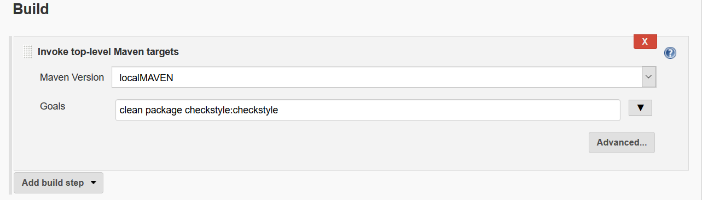
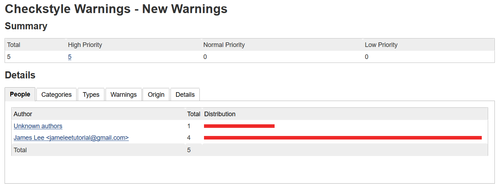
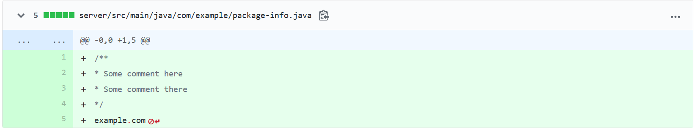
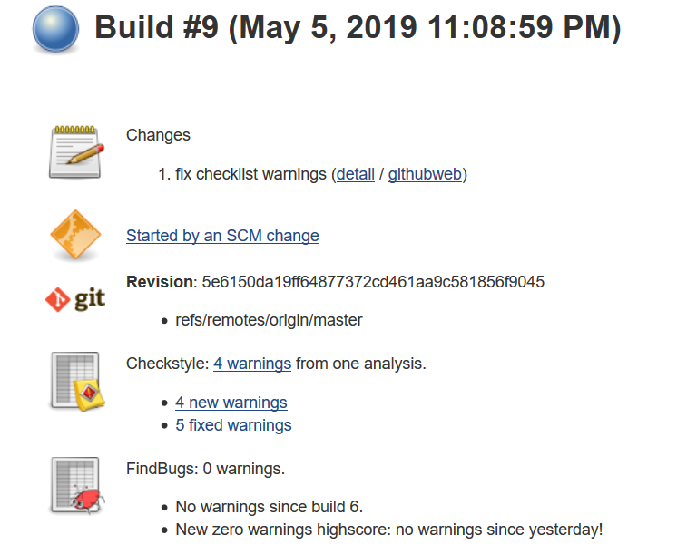

###  Code Quality and Code Coverage Metrics Report

Jenkins is capable to doing more advance code analysis like **Code Quality**.
Code Quality might be a loose term and may be directly influenced by the scope of the software.
Good code has:

* Clarity: Easy to read and oversee for anyone who isn’t the creator of the code. If it’s easy to understand, it’s much easier to maintain and extend the code. Not just computers, but also humans need to understand it.
* Maintainable: A high-quality code isn’t overcomplicated. Anyone working with the code has to understand the whole context of the code if they want to make any changes.
* Documented
* Clear and understandable design and implementation.
* Well defined interfaces.
* Ease of build and use.
* Ease of extensibility.
* Minimum extra dependencies.
* Tests and examples.
* Documentation, better yet -- self-explaining code.
* Up to date means to contact the developer.

**Code Coverage** refers to the amount of code covered by a particular test.
A program with high test coverage, measured as a percentage, has had more of its source code executed during testing, which suggests it has a lower chance of containing undetected software bugs compared to a program with low test coverage.

Jenkins has integrated plugins to help analyze the code.
[CheckStyle](https://checkstyle.org/) is one of these plugins.
Checkstyle is a development tool to help programmers write Java code that adheres to a coding standard. It automates the process of checking Java code to spare humans of this boring (but important) task. This makes it ideal for projects that want to enforce a coding standard

* Javadoc comments for classes, attributes and methods;
* Naming conventions of attributes and methods;
* The number of function parameters;
* Line lengths;
* The presence of mandatory headers;
* The use of imports, and scope modifiers;
* The spaces between some characters;
* The practices of class construction;
* Multiple complexity measurements.

To specify the checkstyle code analysis we just need to add the **checkstyle:checkstyle** option on the **build goals**


Following the build we see an code analysis:



After fixing the errors we commit the changes to github, this would trigger a build:

```buildoutcfg
git add server/src/main/java/com/example/Greeter.java
git add server/src/main/java/com/example/package-info.java
git commit -m "fix checklist warnings"
[master 6a4e364] fix checklist warnings
 2 files changed, 10 insertions(+), 2 deletions(-)
 create mode 100644 server/src/main/java/com/example/package-info.java
git push origin master
```

We see one last warning, seems that in the package-info.java we are missing a new line:



After we fix all the checklist warnings



Jenkins supports as well other build scripts such as **Ant/Gradle/shell scripts**

### Todos setup 2 tomcat instances

Ref:

* https://stackoverflow.com/questions/16110528/tomcat-multiple-instances-simultaneously

### Jekins plugins

* https://www.level-up.one/6-of-my-favorite-jenkins-plugins/


Ref:
*   https://www.quora.com/How-do-you-define-code-quality
*   https://en.wikipedia.org/wiki/Code_coverage
*   https://stackoverflow.com/questions/195008/what-is-code-coverage-and-how-do-you-measure-it

 

