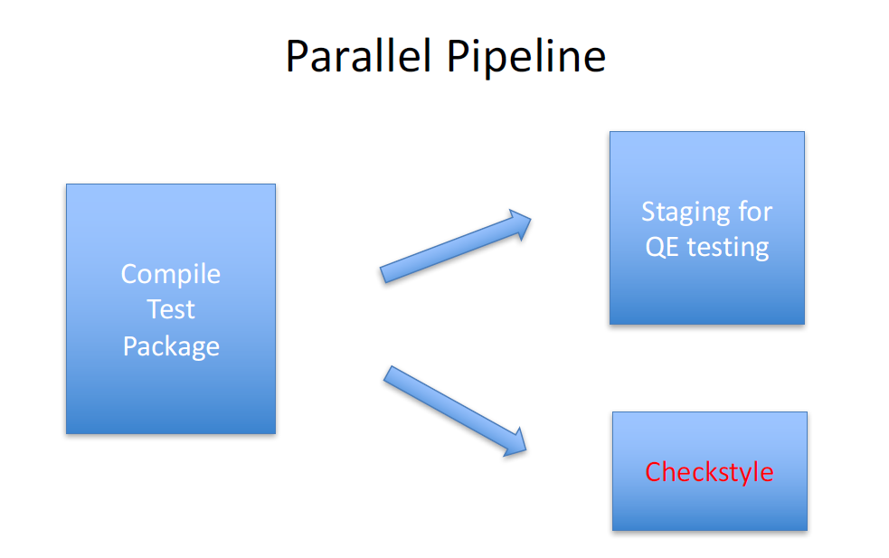
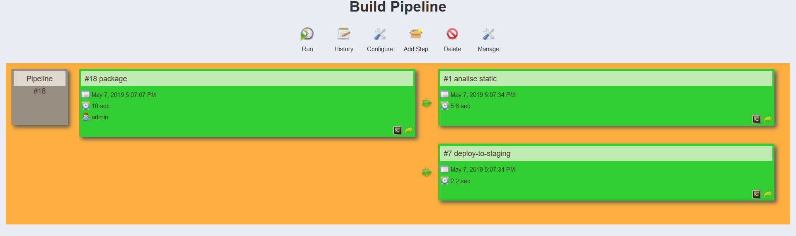
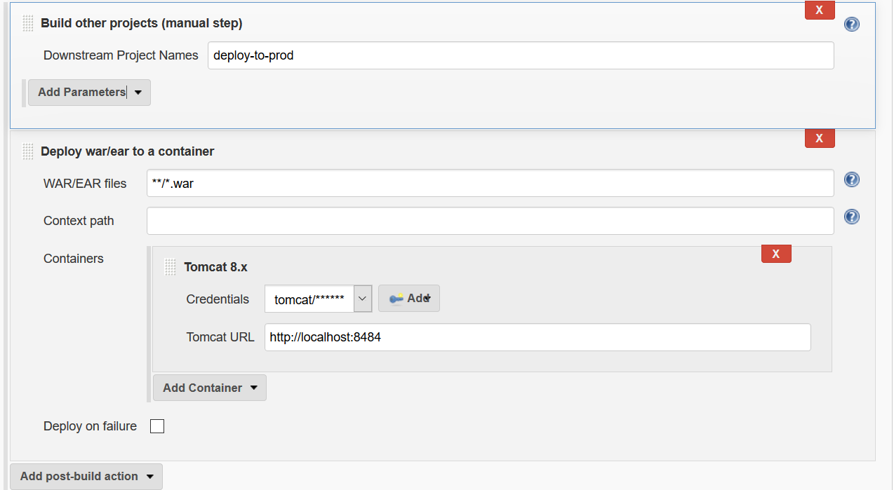
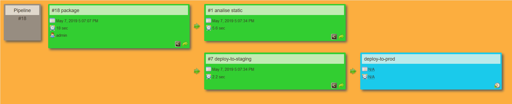

### Archive artifacts

A typical Jenkins workflow would be to package the software file post build and deploy it in a staging environment.

 

We can simulate this by action by invoking archive action in the post build section of the job.
Next we trigger a build manually.


In a real world scenario we might have build jobs that incorporate many steps.
It can be hard to follow along these steps. We can use a build pipeline plug in which can help us define a better view of the build process.


The most inportant step is to define the initial build step.


To optimise the build pipeline we might execute some jobs in parallel to improve time.
In our case we can remove the checkstyle from the initial build step and set it up as a independent build.
In the **package** build step ce can setup as post build the **static analysis** build step

 



In another real world scenario the application would be deployed to production.
We will copy the existing tomcat installation and create a deployment instance:

```buildoutcfg
05/08/2019  03:03 PM           113,663 apache-tomcat-8.5.40-deploy
04/10/2019  03:33 PM    <DIR>          apache-tomcat-8.5.40-stage
```

We must change the client port so it won't overlap with the existing installation

```buildoutcfg
<Connector port="9494" protocol="HTTP/1.1"
               connectionTimeout="20000"
               redirectPort="8443" />
```

The deploy job will copy the artifacts from package job once this is completed successfully.
The deploy job depends on the staging job but as trigger we will select manual.




Run the pipeline

