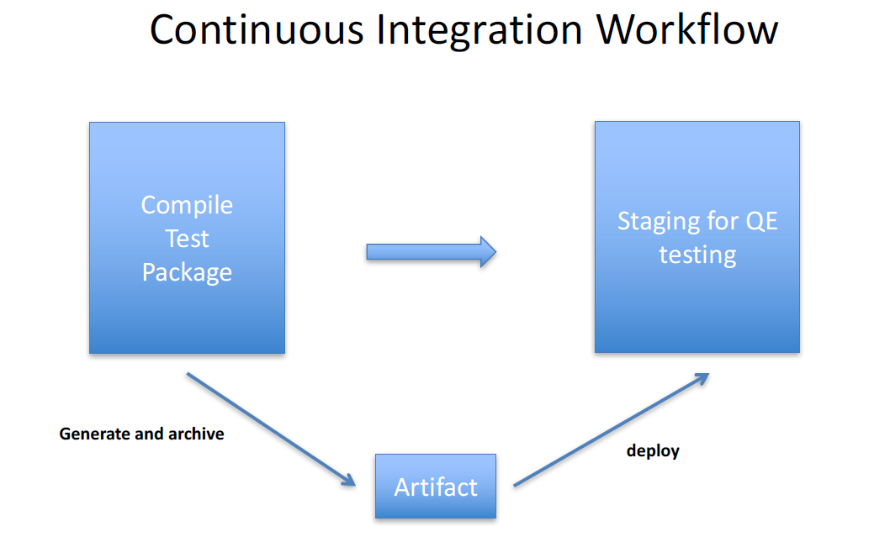
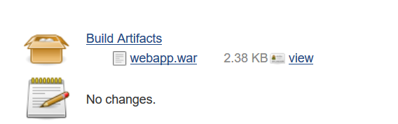
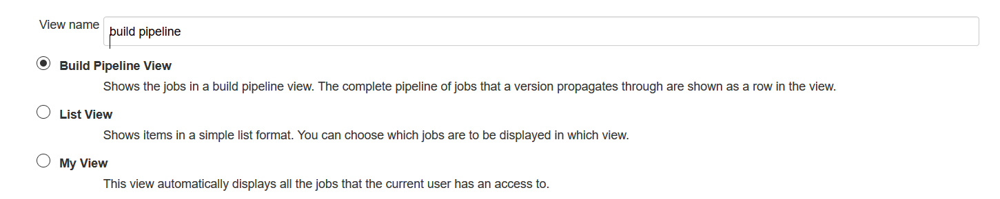
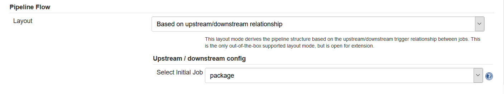
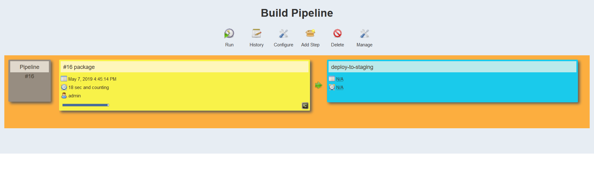

### Archive artifacts

A typical Jenkins workflow would be to package the software file post build and deploy it in a staging environment.

 

We can simulate this by action by invoking archive action in the post build section of the job.
Next we trigger a build manually.

In a real world scenario we might have build jobs that incorporate many steps.
It can be hard to follow along these steps. We can use a build pipeline plug in which can help us define a better view of the build process.

The most inportant step is to define the initial build step.

