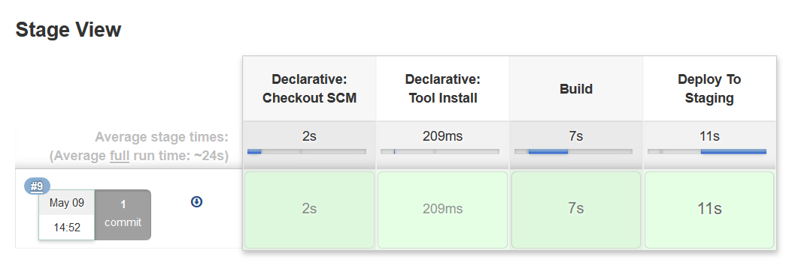
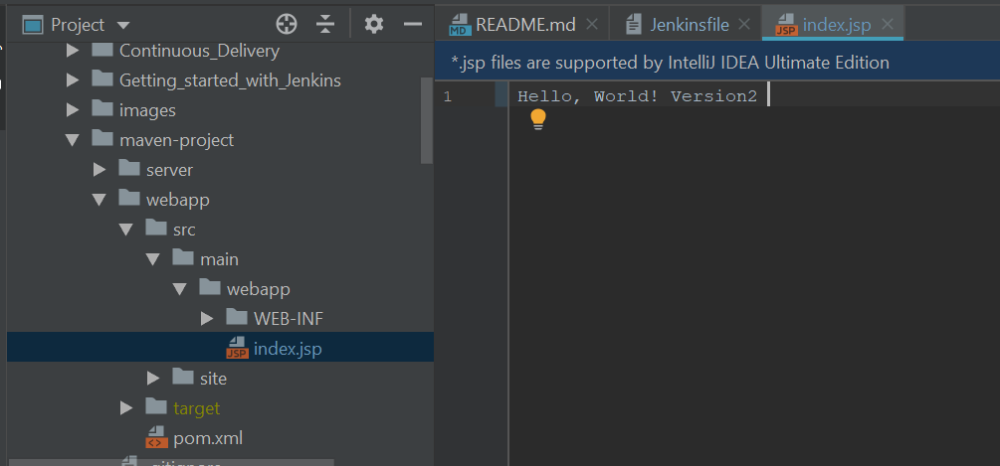

### Pipeline as a Code

Jenkins Pipeline provides an extensible set of tools for modeling simple-to-complex delivery pipelines "as code". The definition of a Jenkins Pipeline is typically written into a text file (called a Jenkinsfile) which in turn is checked into a project’s source control repository.
Jenkinsfile is a text file that contains the definition of a Jenkins Pipeline and is checked into source control.
 
Example below contains a pipeline with 3 stages

```buildoutcfg
pipeline {
    agent any
    tools {maven 'localMAVEN'
        jdk 'localJDK'
        }
    stages {
        stage('Build') {
            steps {
                echo 'Building..'
            }
        }
        stage('Test') {
            steps {
                echo 'Testing..'
            }
        }
        stage('Deploy') {
            steps {
                echo 'Deploying....'
            }
        }
    }
}
``` 

Add another stage deploy to slanging platform. We just need to add another stage step:

```buildoutcfg
stage ('Deploy To Staging'){
            steps {
                build job: 'Deploy-to-staging'
            }
        }
```



### Deploy to production

We will simulate a deploy to production pipeline using Jenkins file.
To be sure the changes are generated by the build **Jenkinsfile** we make a change in the index file



Alter the Jenkinsfile

```buildoutcfg
  stage ('Deploy to Production'){
            steps{
                timeout(time:5, unit:'DAYS'){
                    input message:'Approve PRODUCTION Deployment?'
                }

                build job: 'Deploy-to-Prod'
            }
            post {
                success {
                    echo 'Code deployed to Production.'
                }

                failure {
                    echo ' Deployment failed.'
                }
            }
        }
```

Commit the changes and push to git

### Benefits of a code-based pipeline

* Version control
* Best Practices
* Less error-prone execution of jobs
* Logic-based execution of steps

References:

* https://jenkins.io/doc/pipeline/tour/hello-world/
* https://jenkins.io/doc/book/pipeline/jenkinsfile/

