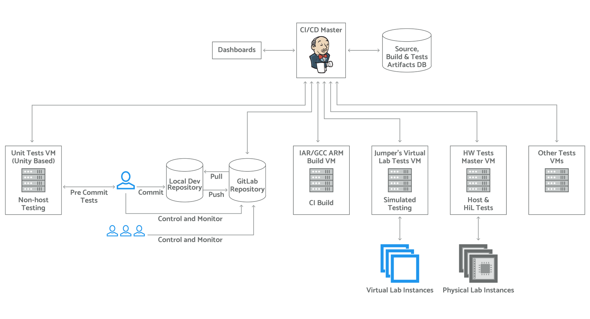
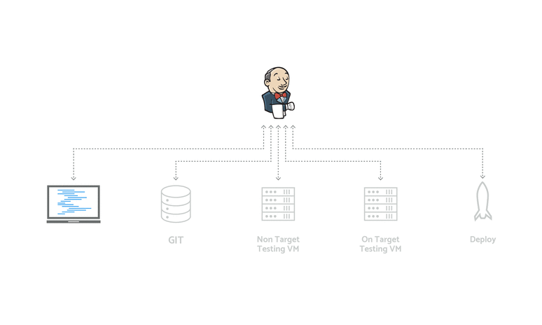

# CI-CD_with_Jenkins
Continuous Integration/Continuous Delivery pipeline with Jenkins


### What is Jenkins?

Jenkins is a self-contained, open source automation server which can be used to automate all sorts of tasks related to building, testing, and delivering or deploying software.

### High Level Overview:



### Jenkins Workflow:



Jenkins can be installed through native system packages, Docker, or even run standalone by any machine with a `Java Runtime Environment (JRE) installed`.

### Java requirements

There are separate run and job execution requirements for Jenkins installations.
### Running Jenkins

Modern Jenkins versions have the following Java requirements:

  - Java 8 is the ONLY currently supported runtime environment, both 32-bit and 64-bit versions are supported
  - Older versions of Java are not supported
  - Java 9 and Java 10 are not supported
  - Java 11 preview support is available in Jenkins 2.155+
  - This page provides guidelines about running Jenkins with these versions
  - Java 12 is not supported

These requirements apply to all components of the Jenkins system including Jenkins master, all types of agents, CLI clients, and other components.

Jenkins project performs a full test flow with the following JDK/JREs:
```
    OpenJDK JDK / JRE 8 - 64 bits
```

Download `java 8 x64` from [Oracle](https://java.com/en/download/linux_manual.jsp) and install:

```
apt-get install java-8-openjdk-amd64
```

On an OS there can be multiple versions of software running, with different dependencies.
To address this we will manage multiple java environments using `alternatives`.
Using `-s` switch in update-alternatives we can specify the default version.

```
update-java-alternatives -s
```

List all java versions:

```
update-alternatives --config java
There are 4 choices for the alternative java (providing /usr/bin/java).

  Selection    Path                                            Priority   Status
------------------------------------------------------------
  0            /usr/lib/jvm/java-11-openjdk-amd64/bin/java      1111      auto mode
  1            /usr/lib/jvm/java-10-openjdk-amd64/bin/java      1101      manual mode
  2            /usr/lib/jvm/java-11-openjdk-amd64/bin/java      1111      manual mode
* 3            /usr/lib/jvm/java-8-openjdk-amd64/jre/bin/java   1081      manual mode
  4            /usr/lib/jvm/java-9-openjdk-amd64/bin/java       1091      manual mode
```

### Install Jenkins:

```
wget -q -O - https://pkg.jenkins.io/debian/jenkins.io.key | sudo apt-key add -
sudo sh -c 'echo deb http://pkg.jenkins.io/debian-stable binary/ > /etc/apt/sources.list.d/jenkins.list'
sudo apt-get update
sudo apt-get install jenkins
```

### Web login

If everything goes wright we can access jenkins on `http://localhost:8080`.


Post installation we must create an admin user and setup a password.

References:
  https://jenkins.io/doc/book/installing/

  https://issues.jenkins-ci.org/browse/JENKINS-40689

  https://wiki.jenkins.io/display/JENKINS/How-to+articles

  https://jenkins.io/doc/administration/requirements/java/

  https://dzone.com/articles/installing-openjdk-11-on-ubuntu-1804-for-real

  https://linux.die.net/man/8/update-alternatives

  https://askubuntu.com/questions/315646/update-java-alternatives-vs-update-alternatives-config-java

  https://stackoverflow.com/questions/12787757/how-to-use-the-command-update-alternatives-config-java
